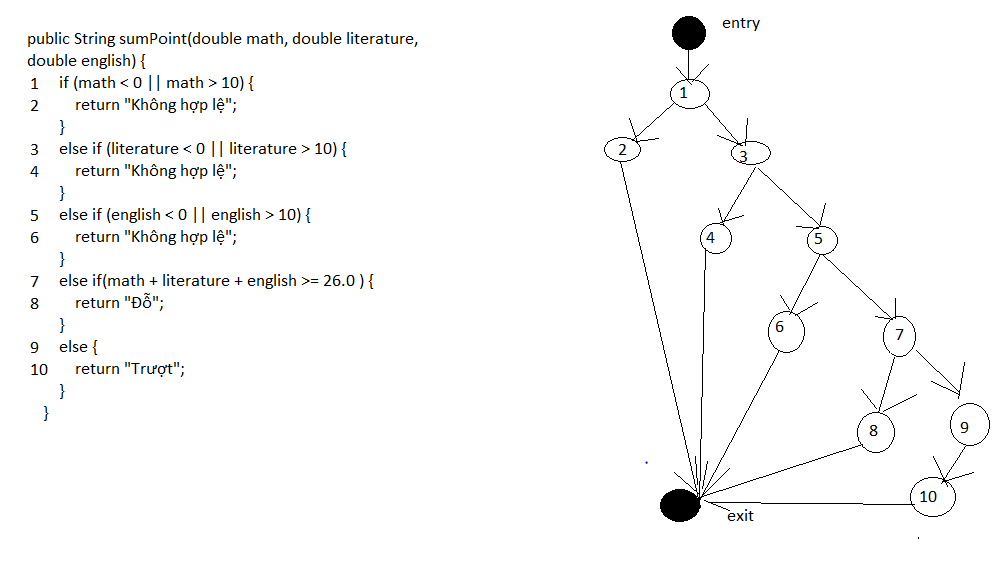

# Kiểm thử hộp đen
### Họ và Tên: Phạm Bích Ngọc - Mã sinh viên: 20020454
## Bài toán
Một học sinh thi THPTQG cần ba môn Toán, Ngữ Văn, Tiếng Anh. Biết để đỗ NV1 cần tổng ba môn tối thiểu 26 điểm. Viết các ca kiểm thử dựa trên phương pháp giá trị biên và phân hoạch tương đương
## Phân tích bài toán
Mỗi môn Toán, Ngữ Văn, Tiếng Anh có thang điểm 10 với giá trị điểm hợp lệ thuộc khoảng 0 đến 10. Tổng ba môn tối thiểu là 0 điểm, tối đa là 30 điểm. Xét giá trị điểm theo dạng double.
### 1. Dựa trên phương pháp giá trị biên
Xác định giá trị max = 10.0; max- = 9.9; nom = 5.0; min+ = 0.1; min = 0.0. Dựa vào phương pháp kiểm thử giá trị biên mạnh. Ta có bảng các ca kiểm thử như sau: 
| Toán | Ngữ Văn | Tiếng Anh | Actual Output | Expected Output |
| ---- | ------- | --------- | ------------- | --------------- |
| 5.0  |    5.0  |     10.0  | Trượt         | Trượt           |
| 5.0  |    5.0  |     9.9   | Trượt         | Trượt           |
| 5.0  |    5.0  |     5.0   | Trượt         | Trượt           |
| 5.0  |    5.0  |     0.1   | Trượt         | Trượt           |
| 5.0  |    5.0  |     0.0   | Trượt         | Trượt           |
| 5.0  |    10.0 |     5.0   | Trượt         | Trượt           |
| 5.0  |    9.9  |     5.0   | Trượt         | Trượt           |
| 5.0  |    0.1  |     5.0   | Trượt         | Trượt           |
| 5.0  |    0.0  |     5.0   | Trượt         | Trượt           |
| 10.0 |    5.0  |     5.0   | Trượt         | Trượt           |
| 9.9  |    5.0  |     5.0   | Trượt         | Trượt           |
| 0.1  |    5.0  |     5.0   | Trượt         | Trượt           |
| 0.0  |    5.0  |     5.0   | Trượt         | Trượt           |
### 2. Dựa vào phân hoạch tương đương
Xác định 3 miền giá trị cho đầu vào mỗi môn học như sau:\
A = (-∞; 0.0) : không hợp lệ \
B = [0.0; 10.0] : hợp lệ \
C = (10.0; ∞) : không hợp lệ \
Chọn giá trị -5.0 thuộc A, 5.0 thuộc B và 15.0 thuộc C. \
Dựa vào phương pháp phân hoạch tương đương mạnh ta có bảng sau:
| Toán | Ngữ Văn | Tiếng Anh | Actual Output | Expected Output |
| ---- | ------- | --------- | ------------- | --------------- |
|  5.0 |    5.0  |     5.0   | Trượt         | Trượt           |
| -5.0 |    5.0  |     5.0   | Không hợp lệ  | Không hợp lệ    |
| 15.0 |    5.0  |     5.0   | Không hợp lệ  | Không hợp lệ    |
|  5.0 |   -5.0  |     5.0   | Không hợp lệ  | Không hợp lệ    |
|  5.0 |   15.0  |     5.0   | Không hợp lệ  | Không hợp lệ    |
|  5.0 |    5.0  |    -5.0   | Không hợp lệ  | Không hợp lệ    |
|  5.0 |    5.0  |    15.0   | Không hợp lệ  | Không hợp lệ    |
### 3. Dựa vào dòng điều khiển
Dưới đây là đồ thị dòng điều khiển của chương trình
  
Dựa vào phương pháp kiểm thử dòng điều kiện với độ phủ C2 ta có bảng các ca kiểm thử như sau:
| Toán | Ngữ Văn | Tiếng Anh | Actual Output | Expected Output |
| ---- | ------- | --------- | ------------- | --------------- |
|  5.0 |    5.0  |     5.0   | Trượt         | Trượt           |
| -5.0 |    5.0  |     5.0   | Không hợp lệ  | Không hợp lệ    |
|  5.0 |    5.0  |    -5.0   | Không hợp lệ  | Không hợp lệ    |
|  5.0 |   -5.0  |     5.0   | Không hợp lệ  | Không hợp lệ    |
|  9.0 |    8.0  |    9.0    |      Đỗ       |       Đỗ        |
